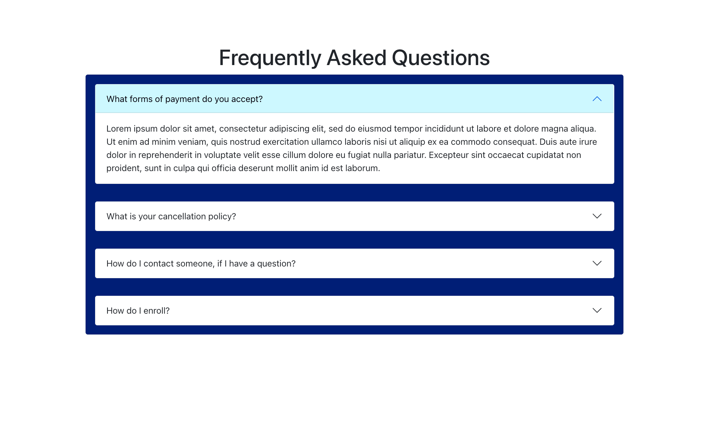

# React FAQ

## **Description**

ReactJS Frequently Asked Questions (FAQ) component built with React-Bootstrap

## **Table of Contents**
* [Installation](#installation)
* [Usage](#usage)
* [Licenses](#licenses)
* [Badges](#Badges)
* [Questions](#questions)

### **Installation**
npm i

### **Usage**

### **Technologies Used:**
ReactJS
React-Bootstrap
JavaScript
CSS

### *Licenses*
MIT license

### *Badges*

### *Questions*
If you have any questions, reach out to me on Git Hub https://github.com/JJLindsey, or send me a message jlindsey010@gmail.com.

©Jennifer Lindsey 2021